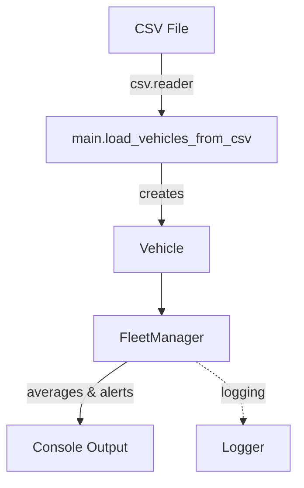

# Fleet Management System (Python)

A production-quality, object-oriented Fleet Management System for loading vehicle telemetry from CSV, computing fleet statistics, and generating alerts for critical conditions. Designed for clarity, robustness, testability, and easy extensibility by new team members.

## 1) Project Overview & Introduction

The system models an automotive fleet with vehicles reporting speed, engine temperature, and fuel level.
It provides:
- Loading vehicles from a CSV file (`id,speed,temperature,fuel`)
- Validation and sanitization of all inputs
- Computation of averages (speed, temperature, fuel)
- Alerting:
  - Temperature > threshold → "Critical Overheating"
  - Fuel < threshold → "Low Fuel Warning"
- Logging of issues and alerts for observability

Core goals: correctness, PEP 8 readability, maintainability, and performance with large datasets.

## 2) System Requirements

- Python: 3.10+
- IDE: VS Code, PyCharm, or your preferred editor
- Standard library modules used:
  - `csv` for parsing CSV input
  - `logging` for diagnostics and alert logs
  - `unittest` for the test suite
- Optional tools:
  - `pytest` and `pytest-cov` for advanced testing and coverage
  - `black`, `ruff`/`flake8` for formatting and linting

## 3) Project Structure

```
.
├─ vehicle.py         # Vehicle domain model with strict validation
├─ fleet_manager.py   # Fleet orchestration: averages, alerts, summaries
├─ main.py            # CLI entrypoint and CSV loader
├─ tests.py           # Unit + integration tests (unittest)
├─ vehicles.csv       # Sample data (dev only)
└─ README.md          # This documentation
```

### Files, classes, and responsibilities

| File | Class/Function | Responsibility |
|------|-----------------|----------------|
| `vehicle.py` | `Vehicle` | Represents a single vehicle; validates `id`, `speed`, `temperature`, `fuel`; string representations. |
| `fleet_manager.py` | `FleetManager` | Manages a list of `Vehicle` objects; computes averages; generates alerts; provides summaries. |
| `main.py` | `load_vehicles_from_csv`, `main` | Loads CSV into `Vehicle` objects; handles errors; prints summaries, averages, and alerts. |
| `tests.py` | test classes | Unit + integration tests for all modules, edge and boundary cases, and CSV processing. |

### Module interaction (high level)



## 4) Classes & Functions Explanation

### `vehicle.py`

- Class: `Vehicle(id: str, speed: int, temperature: int, fuel: int)`
  - Validates:
    - `id`: non-empty string
    - `speed`: integer in [0, 300]
    - `temperature`: integer in [-50, 200]
    - `fuel`: integer in [0, 100]
  - Methods:
    - `__str__`: Human-readable representation
    - `__repr__`: Debug-friendly representation
  - Edge cases: invalid types, out-of-range values, empty IDs
  - Example:

```python
from vehicle import Vehicle
v = Vehicle("V1", 120, 95, 40)
print(v)  # Vehicle(id=V1, speed=120 km/h, temperature=95°C, fuel=40%)
```

### `fleet_manager.py`

- Class: `FleetManager(vehicles: list[Vehicle] | None = None)`
  - Methods:
    - `add_vehicle(vehicle: Vehicle) -> None`
    - `average_speed() -> float | None`
    - `average_temperature() -> float | None`
    - `average_fuel() -> float | None`
      - Returns `None` if the fleet is empty (prevents division-by-zero and makes emptiness explicit)
    - `get_alerts() -> list[dict[str, str]]`
      - Temperature > `CRITICAL_OVERHEAT_TEMP` → "Critical Overheating"
      - Fuel < `LOW_FUEL_THRESHOLD` → "Low Fuel Warning"
      - Logs alerts with `logging.warning`
    - `summary() -> str`
  - Example:

```python
from vehicle import Vehicle
from fleet_manager import FleetManager

fleet = FleetManager([
    Vehicle("V1", 120, 130, 10),
    Vehicle("V2", 80, 90, 40),
])
print(fleet.summary())
print(fleet.average_speed())
print(fleet.get_alerts())
```

### `main.py`

- Function: `load_vehicles_from_csv(file_path: str) -> list[Vehicle]`
  - Robust CSV parsing:
    - Skips malformed rows (missing fields, bad types, out-of-range)
    - Logs errors; keeps processing remaining rows
    - Raises `FileNotFoundError` if the CSV file does not exist
- Function: `main(argv: list[str] | None = None) -> int`
  - Orchestrates loading, computations, printing, and exits with status codes:
    - `0` success
    - `1` missing CSV file
    - `2` usage error (no CSV argument provided)

## 5) Constants & Thresholds

Defined in `fleet_manager.py` and `vehicle.py` for easy tuning:
- Validation ranges:
  - `MIN_SPEED=0`, `MAX_SPEED=300`
  - `MIN_TEMPERATURE=-50`, `MAX_TEMPERATURE=200`
  - `MIN_FUEL=0`, `MAX_FUEL=100`
- Alert thresholds:
  - `CRITICAL_OVERHEAT_TEMP=110` (trigger when temperature > 110)
  - `LOW_FUEL_THRESHOLD=15` (trigger when fuel < 15)

To modify thresholds, edit the constants in `fleet_manager.py` and re-run.

## 6) Sample Input/Output

### Sample CSV (`vehicles.csv`)
```
V1,120,130,10
V2,80,90,40
V3,0,85,50
```

### Expected Console Output
```
Fleet Management System
=========================

Fleet Summary:
Vehicle(id=V1, speed=120 km/h, temperature=130°C, fuel=10%)
Vehicle(id=V2, speed=80 km/h, temperature=90°C, fuel=40%)
Vehicle(id=V3, speed=0 km/h, temperature=85°C, fuel=50%)

Averages:
  Speed: 66.67 km/h
  Temperature: 101.67°C
  Fuel: 33.33%

Alerts:
  Vehicle V1: Critical Overheating
  Vehicle V1: Low Fuel Warning
```

### Boundary Cases
- Temperature exactly at 110 → no "Critical Overheating" (uses `>`)
- Fuel exactly at 15 → no "Low Fuel Warning" (uses `<`)

### Empty/Malformed CSV Handling
- Empty CSV → loads 0 vehicles, averages print as `N/A`, summary reports no vehicles
- Malformed rows (e.g., missing fields, text in numeric columns, out-of-range values) → logged and skipped

## 7) Workflow & Integration Guide

### Running the Project

```bash
python main.py vehicles.csv
# Or specify a custom path
python main.py path/to/your.csv
```

### Running Tests (unittest)

```bash
python -m unittest -v
```

### Modifying Thresholds
- Open `fleet_manager.py`
- Update `CRITICAL_OVERHEAT_TEMP` and `LOW_FUEL_THRESHOLD`

### Extending Functionality
- Add new metrics (e.g., battery state, oil pressure):
  - Update `Vehicle` to include new attribute with validation
  - Add aggregation/alert logic to `FleetManager`
  - Extend tests in `tests.py`
- Integrate other inputs (e.g., JSON, APIs):
  - Create new loader function (e.g., `load_vehicles_from_json`)
  - Reuse `Vehicle` and `FleetManager`

## 8) Edge Cases & Best Practices

- Empty CSVs and malformed rows are handled gracefully with logging; the process continues.
- Averages on empty fleets return `None` by design; the CLI prints `N/A`. If your domain requires, you can choose to raise exceptions instead.
- For large datasets:
  - Prefer generator patterns and streaming I/O
  - Consider `pandas.read_csv()` for vectorized operations and schema enforcement
  - Avoid materializing unnecessary copies of data
- Logging:
  - Alerts use `logging.warning`; configuration can be customized per environment
- Validation:
  - Defensive validation prevents corrupt data from contaminating computations

## 9) Testing & Validation Strategy

- Unit tests (`tests.py`):
  - `Vehicle` validation (types, ranges, IDs)
  - `FleetManager` averages and alerts (including thresholds and boundaries)
  - Edge cases: empty fleets, single vehicle, malformed CSV rows
- Integration tests (`tests.py`):
  - CSV loading via temporary files
  - CLI end-to-end behavior with exit codes and stdout validation

Run tests:
```bash
python -m unittest -v
```

Optional (pytest):
```bash
pip install pytest pytest-cov
pytest -q --maxfail=1 --disable-warnings --cov=.
```

## 10) Contribution Guidelines

- Fork or branch from `main`
- Write clear, well-documented code (PEP 8)
- Add/extend tests for all changes
- Keep functions short and focused; prefer composition over large classes
- Discuss schema/threshold changes with the team before merging

## 11) Future Enhancements

- Support additional data sources (APIs, databases)
- Real-time ingestion and streaming alerting
- Role-based dashboards, reports, and visualization
- Persist results for historical analytics
- Configurable alerting via email/SMS/webhooks

## 12) Quick Start (TL;DR)

```bash
# 1) Ensure Python 3.10+
python --version

# 2) Run with sample CSV
python main.py vehicles.csv

# 3) Run tests
python -m unittest -v
```

If you have questions, start by reading `vehicle.py`, then `fleet_manager.py`, and finally `main.py`. The `tests.py` file demonstrates expected behaviors and is a great companion for understanding the system.

## Appendix: Design Choices

- Averages return `None` on empty fleets: avoids exceptions and clarifies emptiness at call sites; the CLI prints `N/A` accordingly.
- Validation boundaries are conservative but configurable to match domain expectations.
- Alert comparisons are strictly `>` (temperature) and `<` (fuel) to ensure boundary values are treated as nominal unless exceeded.
